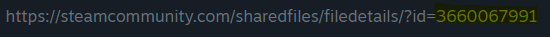

# EU5 Mod Devkit

A development kit for Europa Universalis V (EU5) including a template and tools for creating mods.

## Requirements

- **Python 3.x**: Required for running the setup and release scripts.
- **Git**: Required for version control and using the devkit tools.
- **Europa Universalis V**: The game this devkit is designed for.

## Project Structure

```text
eu5-mod-devkit/
├── .metadata/                  # Mod metadata and thumbnails
│   ├── metadata.json            # Mod configuration (name, id, tags, etc.)
│   ├── thumbnail.png            # Default/Dev thumbnail template
│   └── thumbnail-release.png    # Release thumbnail template
├── assets/                     # Source assets (images, etc.)
│   └── images/                  # Images used in the mod
│       ├── thumbnail.psd          # Photoshop template for the thumbnail
│       └── thumbnail-alt.psd      # Alternative Photoshop template for the thumbnail
├── scripts/                    # Automation scripts
│   ├── dependencies/           # SteamworksPy DLLs, steam_appid.txt, requirements.txt, and steamworks module
│   ├── setup.py                 # Initial project setup script
│   ├── upload-mod.py            # Build a minimal release folder and upload it to Steam Workshop
│   ├── translate.py             # Auto-translate localization files with DeepL or Gemini
│   ├── upload-mod-pages.py      # Upload Steam Workshop title/description per language
│   ├── create-devkit-release.sh # (Internal) Devkit release management
│   └── reset-release.sh         # (Internal) Devkit release management
├── in_game/common/dummy.txt    # stub file to create the folder
├── main_menu/
│   └── localization
│       └── english
│          └── tmp_l_english.yml    # localization template file
├── .editorconfig               # Standardizes editor settings for EU5
├── .gitattributes              # Makes all text files use crlf line endings
├── .gitignore                  # Standard gitignore
├── .env-template               # For setting the DeepL & Gemini api keys
├── LICENSE                     # (Internal) Project license
├── README.md                   # (Internal) This file
└── README-TEMPLATE.md          # GitHub repo readme template, will be copied to README.md in the release branch.
```
* Files marked as `(internal)` are not included in the release version, and are just for the devkit's own use. You do not need to copy them, and they will not be included if you run the setup script.

## Setup

### setup.py
This will copy all files from the `release` branch into your mod folder, and add the devkit repository as a remote.
By having the devkit as a remote, you can easily update the devkit by merging from the remote `tools/devkit` branch.

1. **Push your mod to a Git repository**:
   * **Existing Mods**: If you haven't already, push your mod to a Git repository.
   * **New Mods**: Create, initialize, and push, a new empty Git repo in the Europa Universalis V/mod folder.
2. a) From the root of your mod folder, run:
   ```bash
   curl -sL https://raw.githubusercontent.com/conner-olsen/eu5-mod-devkit/devkit-release/scripts/setup.py -o setup.py && python setup.py
   ```
   *Note: The script will not overwrite any existing files and can be run on existing repositories safely.*

After running, the setup script will delete itself and should not need to be used again.

Once the devkit files are in place, install the Python dependencies:

### Manual Setup
1. Copy any files you want to use from the `release` branch into your mod folder.
2. Install the Python dependencies:
```bash
pip install -r scripts/dependencies/requirements.txt
```

Note that without the devkit remote, you will have to manually check and copy over updates to the devkit.

If you are familiar with Git, you can also manually add the remote for ease of updating.

## Provided Tools

### upload-mod.py
Builds a minimal release folder and uploads it to Steam Workshop.
* Tooling, git files, and anything else you don't want on the workshop will get omitted from the release version.
* Separate IDs, names, and (optionally) thumbnails allow you to easily swap between your dev, and workshop versions through the in-game mod manager.
* Makes it easy to swap between for joining multiplayer sessions.
* Can more easily swap to the released version to verify reported issues.
* Pushes the release version straight to Steam Workshop using the item id from `scripts/config.toml`.
* Use `--dev` to upload a dev Workshop item with the dev thumbnail and name.
* If the configured Workshop item id is `0`, the script will create a new item and write the id back to `scripts/config.toml`.

To use the script:
1. **Modify Metadata**: Edit `.metadata/metadata.json` adding ` Dev` and `.dev` to the name and id respectively.
2. **(optionally) Add Separate Release/Dev Thumbnails**: If you want to use a different thumbnail for the release version:
   * The dev thumbnail will use `.metadata/thumbnail.png`.
   * Make the release thumbnail `.metadata/thumbnail-release.png` (if it does not exist, the `.metadata/thumbnail.png` will be used for both).
3. **(optionally) Configure Included Files**: By default, the release version only includes the `.metadata/`, `in_game/` and `main_menu/` folders.
   * If you want to include more files (i.e., LICENSE), you can add them to the `SOURCES` list in `scripts/upload-mod.py`.
4. **Set the Workshop item ID**: Update `workshop_upload_item_id` in `scripts/config.toml`, or set it to `0` to create a new item on first upload.
5. **(optional) Configure dev uploads**: Set `workshop_upload_item_id_dev` (or `0` for first-time creation) and `workshop_dev_name` in `scripts/config.toml` for `--dev`.
6. **Run `upload-mod.py`**: When ready to create/update the release version and upload it to the workshop (Steam must be running):
   ```bash
   python scripts/upload-mod.py
   ```
   This will create a new folder `../mod-name-release` with:
   * The metadata.json file from `.metadata/` with " Dev" and ".dev" removed from the name and id respectively.
   * The thumbnail from `.metadata/thumbnail-release.png` or the default thumbnail if it doesn't exist.
   * The `in_game/`, `main_menu/` and any other files specified in the `SOURCES` list of `scripts/upload-mod.py`.
   * Uploads that release folder to the Workshop item specified in `scripts/config.toml`.
7. **(optional) Run a dev upload**:
   ```bash
   python scripts/upload-mod.py --dev
   ```
   This will create a new folder `../mod-name-dev` and upload it using the dev Workshop item id, keeping the dev mod id and dev thumbnail.

### translate.py
Auto-translates localization files using DeepL or Gemini-3-Flash, and can optionally translate Steam Workshop titles/descriptions using DeepL or Gemini-3-Flash.
It reads from `main_menu/localization/<source_language>` and writes translated `.yml` files for every EU5 supported language.

#### Setup
1. Copy `.env-template` to `.env`.
2. Add your DeepL API key as `DEEPL_API_KEY=your_key_here`.
3. If you plan to use Gemini for localization or workshop translations, add `GEMINI_API_KEY=your_key_here` to `.env`.
4. Review and change any settings you want in `scripts/config.toml`
   * `source_language` (english, french, german, spanish, polish, russian, simp_chinese, turkish, braz_por, japanese, korean)
   * `localization_translator` (deepl or gemini-3-flash)
   * `gemini_localization_system_prompt`
   * `translate_workshop` (true/false)
   * `workshop_description_translator` (deepl or gemini-3-flash)
   * `gemini_description_system_prompt`
   * `workshop_title_translator` (deepl or gemini-3-flash)
   * `gemini_title_system_prompt`
5. If using workshop translations:
   * Put your workshop description in `assets/workshop/workshop-description.txt`.
   * Your workshop title is pulled from `.metadata/metadata.json` (`name`), with a trailing ` Dev` removed if present.
   * `$item-id$` in the description is replaced with `workshop_upload_item_id` before translating and uploading.
6. Install the dependencies using `pip install -r scripts/dependencies/requirements.txt` (if you ran the setup script, this is already done)

#### Usage
```bash
python scripts/translate.py
```

#### Behavior
* Preserves EU5 localization tags like `[...], $...$, @...!, #...#!`.
* Automatically skips lines that consist purely of tags or formatting characters.

#### Caching and Updates
* Hashes are stored in `scripts/dependencies/.translate_hashes.json`; delete this file to force re-translation.
* Localization keys that have not changed since the last translation are skipped.
* Workshop descriptions are re-translated only when `assets/workshop/workshop-description.txt` changes, or when the selected provider changes.
* Workshop titles are generated once and never overwritten (delete the translated title files to force re-translation).
* To disable an output language, remove its entry from `TARGET_LANGUAGES` in `scripts/translate.py`.

#### Localization Tags
* `# NO_TRANSLATE` skips a single line.
* `# NO_TRANSLATE BELOW` skips the current line and everything below until the end marker.
* `# NO_TRANSLATE END` ends a `# NO_TRANSLATE BELOW` block (optional; the block can run to EOF).
* `# LOCK` prevents overwriting a translated output line.

#### Workshop Tags and Tokens
* `--NO-TRANSLATE-BELOW--` skips that line and anything below it for workshop translations.
* `$item-id$` is replaced with `workshop_upload_item_id` before translation or upload.
* `===WORKSHOP_TITLE===` marks the title block in translation outputs/templates.
* `===WORKSHOP_DESCRIPTION===` marks the description block in translation outputs/templates.
* `$Translated-Title$`, `$Original-Title$`, `$Translated-Language$`, `$Original-Language$`, `$Translated-Description$`, `$Original-Description$` are optional tokens for `assets/workshop/translations/translation_template.txt`.

#### Workshop Output
* Translated workshop titles/descriptions are written to `assets/workshop/translations/`.
* You can customize the output format by editing `assets/workshop/translations/translation_template.txt`.
* Keep the `===WORKSHOP_TITLE===` and `===WORKSHOP_DESCRIPTION===` markers in the template.
* If the template is missing or invalid, the script falls back to the default output format.

#### Limitations
* DeepL's free tier allows 500k characters per month.
* Gemini's free tier allows 20 requests per day, which allows 2x workshop descriptions, or 1x title+description per day. Localization translation uses far more requests and will exceed the free tier quickly.
* Machine translation is imperfect; expect occasional mistakes.
* Gemini generally seems to perform better than DeepL for the workshop page translations but has lower limits.

### upload-mod-pages.py
Uploads Steam Workshop titles/descriptions for the native language and any translated workshop files.

Setup:
1. Make sure Steam is running, and you are logged into the account that owns the workshop item.
2. Ensure your workshop description exists at `assets/workshop/workshop-description.txt`.
3. Set the upload settings in `scripts/config.toml`:
   * `workshop_upload_item_id` The numeric ID at the end of your mod's Workshop URL.
	 
4. (optional) Run `translate.py` with `translate_workshop = true` to generate workshop page translations.

To run:
```bash
python scripts/upload-mod-pages.py
```

## Credits

`upload-mod-pages.py` uses [SteamworksPy](https://github.com/philippj/SteamworksPy) by Philipp J for Steam Workshop updates.

## License

This project is licensed under the GNU General Public License v3.0; use and modification are allowed with or without attribution.

See the [LICENSE](LICENSE) file for details.
